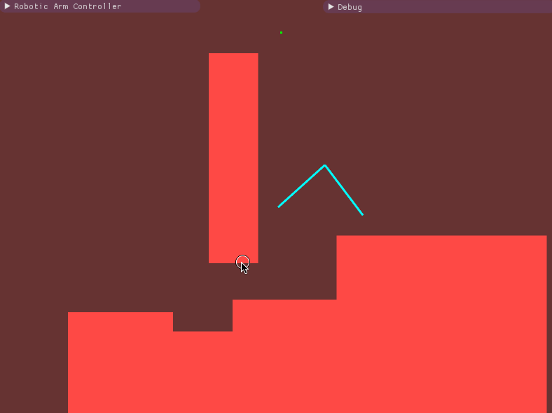

# Flat Kinematic Chain

Flat Kinematic Chain app solves inverse kinematics equations for a flat kinematic chain with two-segment arm. Application allows to find shortest path in configuration space that moves the arm from one configuration to another without touching any of the obstacles. Obstacles can be set up using simple interface during execution.

